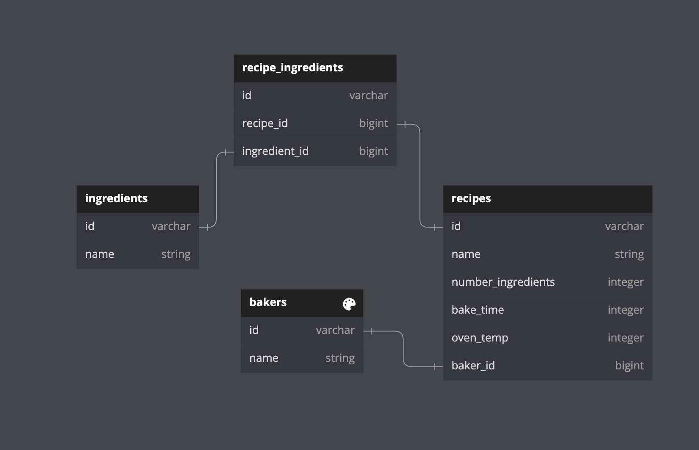

# README

This is a practice project.  It is meant to cover CRUD functions, relationships and routing.  There are 3 resources and 4 tables.  A baker has many recipes, but a recipe is written by only one baker.  A recipe can have many ingredients.  An ingredient can be used in many different recipes.

* Clone, bundle, rake db:create,migrate

* There are failing relationship tests.  Fix these first.  Validation tests are not present.  Add them if you feel like it and have time.

* Add CRUD functionality (try to add all 7 controller actions) for each resource.  No user stories are given, so use your discretion.  I would start with an index page, which has links to a show page for each individual item on the index page.  Then add in functionality to edit an item, create a new item, and delete an item.

* Routes have been created.  Check the /config/routes.rb file.  You will need to update the routes as CRUD functionality is built out.

* If you want, you can practice migrations as well.  For example, you could add a status to the Baker table, showing whether or not the baker is a chef or sous-chef.  

* There is very little, if any, ActiveRecord queries.  You could make up user stories to add them, such as 'What is the average oven temperature needed for cakes', 'What is the total number of ingredients needed for all of the pie recipes', etc.

## Database

 
  

## Strategy to build the program
- For this program I am going to start on the outside and work my way in. The reason being that I want to start with the functionality with the least complicated tables and then start building them out and connecting them. I am going to start testing in this order, `baker`, `ingredient`, `recipe`, and `recipe_ingredient`

### Baker
 - Routes: 
  - index: bakers_path
  - show: baker_path
  - show: baker_recipe_path
  - new:
  - update:
  - create:
  - delete:

### Ingredient
 - Routes: 
  - index:
  - show:
  - show:
  - new:
  - update:
  - create:
  - delete:

### Recipe
 - Routes: 
  - index:
  - show:
  - show:
  - new:
  - update:
  - create:
  - delete:

### RecipeIngredient
 - Routes: 
  - index:
  - show: 
  - show: 
  - new:
  - update:
  - create:
  - delete:

